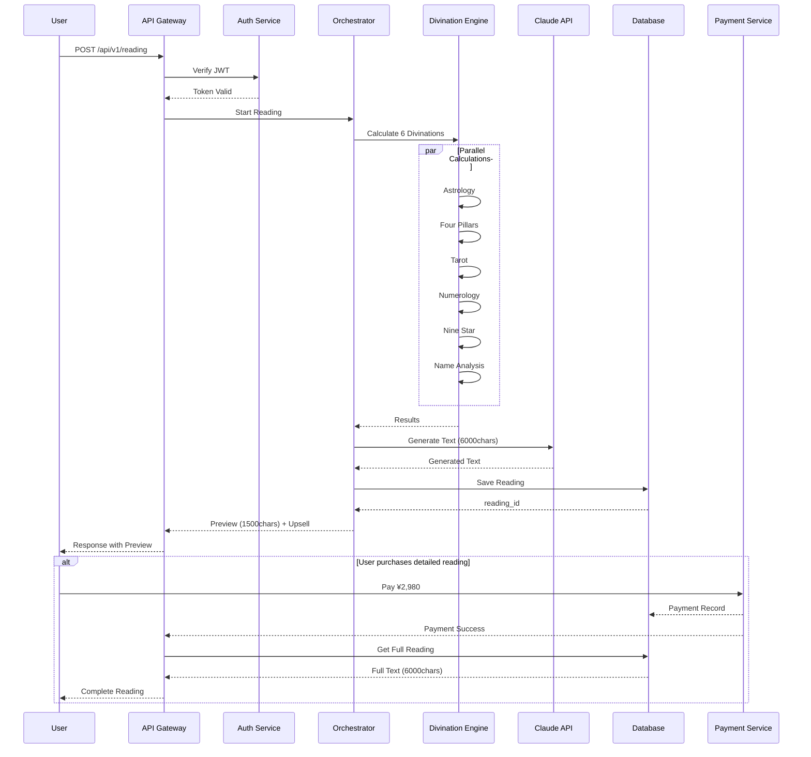

# Nozomi - 統合型AI鑑定システム 開発設計書

**Version:** 1.0.0
**Date:** 2026-01-03
**Status:** 確定版

---

## 目次

1. [システム概要](#1-システム概要)
2. [アーキテクチャ設計](#2-アーキテクチャ設計)
3. [6大占術ロジック仕様](#3-6大占術ロジック仕様)
4. [霊視システム仕様](#4-霊視システム仕様)
5. [出力生成エンジン](#5-出力生成エンジン)
6. [アップセル誘導機構](#6-アップセル誘導機構)
7. [技術仕様](#7-技術仕様)
8. [データフロー](#8-データフロー)
9. [実装ガイドライン](#9-実装ガイドライン)

---

## 1. システム概要

### 1.1 プロジェクト名
**Nozomi（のぞみ / 希）** - 統合型AI鑑定システム

### 1.2 目的
複数の占術体系を統合し、AI技術と組み合わせることで、高精度かつパーソナライズされた鑑定サービスを提供する。6000文字の詳細な鑑定結果と、3段階のアップセル誘導により、ユーザー満足度と収益性を両立する。

### 1.3 主要機能
- **6大占術統合エンジン**: 西洋占星術、四柱推命、タロット、数秘術、九星気学、姓名判断
- **霊視AIモジュール**: 直感的洞察を模倣する深層学習モデル
- **6000文字詳細鑑定**: 構造化された包括的な鑑定レポート
- **3段階アップセル**: 無料→基本→プレミアム→VIP鑑定への誘導

### 1.4 ターゲットユーザー
- **一次**: 20-50代女性、自己理解・人生相談を求める層
- **二次**: 経営者・意思決定者（ビジネス占い需要）
- **三次**: カップル・家族（相性診断需要）

---

## 2. アーキテクチャ設計

### 2.1 システム構成図

```
┌─────────────────────────────────────────────────────────────┐
│                      Frontend Layer                          │
│  ┌──────────────┐  ┌──────────────┐  ┌──────────────┐      │
│  │ Web UI       │  │ Mobile App   │  │ Admin Panel  │      │
│  └──────────────┘  └──────────────┘  └──────────────┘      │
└─────────────────────────────────────────────────────────────┘
                            │
                            ▼
┌─────────────────────────────────────────────────────────────┐
│                      API Gateway Layer                       │
│  ┌──────────────┐  ┌──────────────┐  ┌──────────────┐      │
│  │ REST API     │  │ GraphQL      │  │ WebSocket    │      │
│  └──────────────┘  └──────────────┘  └──────────────┘      │
└─────────────────────────────────────────────────────────────┘
                            │
                            ▼
┌─────────────────────────────────────────────────────────────┐
│                   Core Divination Engine                     │
│  ┌───────────────────────────────────────────────────────┐  │
│  │          Orchestration Controller                     │  │
│  │  - Input validation & normalization                   │  │
│  │  - Multi-divination coordination                      │  │
│  │  - Result synthesis & weighting                       │  │
│  └───────────────────────────────────────────────────────┘  │
│                            │                                 │
│  ┌─────────────────────────┴─────────────────────────┐      │
│  │                                                     │      │
│  ▼                                                     ▼      │
│  ┌──────────────────┐                    ┌──────────────────┐│
│  │ 6大占術モジュール  │                    │  霊視AIモジュール  ││
│  ├──────────────────┤                    ├──────────────────┤│
│  │ 1. 西洋占星術     │                    │ - Transformer    ││
│  │ 2. 四柱推命       │                    │ - Pattern Match  ││
│  │ 3. タロット       │                    │ - Intuition Gen  ││
│  │ 4. 数秘術         │                    └──────────────────┘│
│  │ 5. 九星気学       │                                         │
│  │ 6. 姓名判断       │                                         │
│  └──────────────────┘                                         │
│                            │                                  │
│                            ▼                                  │
│  ┌───────────────────────────────────────────────────────┐   │
│  │         Output Generation Engine (6000文字)           │   │
│  │  - Template selection & customization                 │   │
│  │  - Natural language generation (Claude API)           │   │
│  │  - Structure: Header + Analysis + Advice + Upsell     │   │
│  └───────────────────────────────────────────────────────┘   │
└─────────────────────────────────────────────────────────────┘
                            │
                            ▼
┌─────────────────────────────────────────────────────────────┐
│                   Upsell Guidance Layer                      │
│  ┌──────────────┐  ┌──────────────┐  ┌──────────────┐      │
│  │ Type 1:      │  │ Type 2:      │  │ Type 3:      │      │
│  │ 即時詳細鑑定  │  │ 月額サブスク  │  │ 個別相談予約  │      │
│  └──────────────┘  └──────────────┘  └──────────────┘      │
└─────────────────────────────────────────────────────────────┘
                            │
                            ▼
┌─────────────────────────────────────────────────────────────┐
│                      Data Layer                              │
│  ┌──────────────┐  ┌──────────────┐  ┌──────────────┐      │
│  │ User DB      │  │ Reading DB   │  │ Analytics DB │      │
│  │ (PostgreSQL) │  │ (MongoDB)    │  │ (ClickHouse) │      │
│  └──────────────┘  └──────────────┘  └──────────────┘      │
└─────────────────────────────────────────────────────────────┘
```

### 2.2 技術スタック

| Layer | Technology | Reason |
|-------|-----------|--------|
| **Frontend** | Next.js 14 + TypeScript | SSR, SEO最適化、型安全性 |
| **API** | Node.js + Express | 高速、豊富なエコシステム |
| **AI Engine** | Claude Sonnet 4.5 API | 高精度な自然言語生成 |
| **Divination Logic** | Python 3.11 | 数値計算、天文計算ライブラリ充実 |
| **Database** | PostgreSQL + MongoDB | リレーショナル + ドキュメント併用 |
| **Cache** | Redis | セッション管理、高速アクセス |
| **Deploy** | Docker + Kubernetes | スケーラビリティ、環境一貫性 |

---

## 3. 6大占術ロジック仕様

### 3.1 西洋占星術 (Western Astrology)

#### 3.1.1 入力データ
- 生年月日（YYYY-MM-DD）
- 出生時刻（HH:MM）
- 出生地（緯度・経度）

#### 3.1.2 計算ロジック
```python
# 主要計算項目
1. ホロスコープ作成
   - 10天体の位置計算（太陽、月、水星、金星、火星、木星、土星、天王星、海王星、冥王星）
   - 12ハウスの境界線（アセンダント、MC、ディセンダント、IC）
   - アスペクト（0°, 60°, 90°, 120°, 180°）

2. サイン（星座）分析
   - 太陽星座（基本性格）
   - 月星座（感情・内面）
   - アセンダント星座（外見・第一印象）

3. エレメント・クオリティ分析
   - 火・地・風・水の配分
   - 活動・不動・柔軟の配分

4. 現在のトランジット（運行）
   - 現在の天体位置 vs 出生図
   - 重要なアスペクト検出
```

#### 3.1.3 ライブラリ
- `swisseph` (Swiss Ephemeris) - 高精度天体計算
- `pytz` - タイムゾーン処理

#### 3.1.4 出力形式
```json
{
  "astrology": {
    "sun_sign": "牡羊座",
    "moon_sign": "蟹座",
    "ascendant": "獅子座",
    "planets": {
      "sun": {"sign": "牡羊座", "house": 9, "degree": 15.23},
      "moon": {"sign": "蟹座", "house": 12, "degree": 8.45},
      // ...
    },
    "aspects": [
      {"planet1": "sun", "planet2": "mars", "aspect": "trine", "orb": 2.3}
    ],
    "elements": {"fire": 4, "earth": 2, "air": 3, "water": 1},
    "qualities": {"cardinal": 3, "fixed": 4, "mutable": 3},
    "interpretation": {
      "personality": "リーダーシップに優れ、情熱的...",
      "strength": "決断力、行動力",
      "challenge": "衝動性、短気",
      "current_transit": "木星が10ハウスを通過中..."
    }
  }
}
```

### 3.2 四柱推命 (Four Pillars of Destiny)

#### 3.2.1 入力データ
- 生年月日
- 出生時刻
- 性別

#### 3.2.2 計算ロジック
```python
# 主要計算項目
1. 四柱（年柱・月柱・日柱・時柱）算出
   - 各柱の天干・地支
   - 蔵干の抽出
   - 通変星の決定

2. 五行バランス分析
   - 木・火・土・金・水の配分
   - 強弱判定
   - 用神・忌神の特定

3. 大運・年運の計算
   - 10年周期の大運
   - 現在の運勢期
   - 吉凶判断

4. 十二運星・神殺の判定
   - 長生・沐浴・冠帯・建禄・帝旺・衰・病・死・墓・絶・胎・養
   - 天乙貴人、文昌貴人など
```

#### 3.2.3 出力形式
```json
{
  "four_pillars": {
    "year": {"天干": "甲", "地支": "子", "通変星": "偏印"},
    "month": {"天干": "丙", "地支": "寅", "通変星": "食神"},
    "day": {"天干": "戊", "地支": "午", "通変星": "比肩"},
    "hour": {"天干": "庚", "地支": "申", "通変星": "偏財"},
    "elements": {"木": 2, "火": 3, "土": 2, "金": 2, "水": 1},
    "strength": "身旺",
    "favorable_god": "金・水",
    "unfavorable_god": "火・木",
    "fortune_cycle": {
      "current_age": 35,
      "period": "壬戌",
      "evaluation": "吉"
    },
    "interpretation": {
      "character": "リーダーシップがあり、創造性豊か...",
      "career": "経営者、クリエイター向き",
      "relationships": "情熱的で面倒見が良い",
      "health": "消化器系に注意",
      "advice": "今年は金運に恵まれる..."
    }
  }
}
```

### 3.3 タロット (Tarot)

#### 3.3.1 スプレッド種類
1. **ワンオラクル**: 今日の運勢
2. **スリーカード**: 過去・現在・未来
3. **ケルト十字**: 総合運勢（詳細鑑定時）

#### 3.3.2 計算ロジック
```python
# 擬似ランダム選択（シード値: ユーザーID + 生年月日 + 質問ハッシュ）
import hashlib
import random

def draw_cards(user_data, question, num_cards=3):
    seed_string = f"{user_data['user_id']}{user_data['birth_date']}{question}"
    seed = int(hashlib.sha256(seed_string.encode()).hexdigest(), 16) % (10 ** 8)
    random.seed(seed)

    deck = list(range(78))  # 0-21: Major Arcana, 22-77: Minor Arcana
    drawn = random.sample(deck, num_cards)
    orientations = [random.choice(['upright', 'reversed']) for _ in drawn]

    return [(card, orientation) for card, orientation in zip(drawn, orientations)]
```

#### 3.3.3 カードデータベース
```json
{
  "0": {
    "name": "愚者",
    "name_en": "The Fool",
    "arcana": "major",
    "upright": {
      "keywords": ["新しい始まり", "自由", "冒険"],
      "meaning": "純粋な心で新たな旅立ちを..."
    },
    "reversed": {
      "keywords": ["無謀", "軽率", "無計画"],
      "meaning": "慎重さを欠いた行動に注意..."
    }
  }
  // ... 78枚分
}
```

### 3.4 数秘術 (Numerology)

#### 3.4.1 計算項目
1. **ライフパスナンバー**: 生年月日の総和
2. **ディスティニーナンバー**: 姓名のアルファベット数値化
3. **ソウルナンバー**: 母音の数値
4. **パーソナリティナンバー**: 子音の数値

#### 3.4.2 計算ロジック
```python
def calculate_life_path(birth_date):
    # 例: 1990-03-25 → 1+9+9+0+0+3+2+5 = 29 → 2+9 = 11 (マスターナンバー)
    digits = [int(d) for d in birth_date.replace('-', '')]
    total = sum(digits)

    # マスターナンバー (11, 22, 33) は約分しない
    while total > 9 and total not in [11, 22, 33]:
        total = sum(int(d) for d in str(total))

    return total

def calculate_destiny(full_name):
    # A=1, B=2, ..., Z=26
    alphabet_values = {chr(i): i - 64 for i in range(65, 91)}

    name_clean = full_name.upper().replace(' ', '')
    total = sum(alphabet_values.get(char, 0) for char in name_clean)

    while total > 9 and total not in [11, 22, 33]:
        total = sum(int(d) for d in str(total))

    return total
```

#### 3.4.3 数字の意味
```json
{
  "1": {"keyword": "リーダー", "trait": "独立心、創造性、自信"},
  "2": {"keyword": "協調者", "trait": "協力、調和、感受性"},
  "3": {"keyword": "表現者", "trait": "創造性、社交性、楽観性"},
  "4": {"keyword": "建設者", "trait": "安定、実務的、誠実"},
  "5": {"keyword": "冒険家", "trait": "自由、変化、好奇心"},
  "6": {"keyword": "養育者", "trait": "責任感、愛情、家庭的"},
  "7": {"keyword": "探求者", "trait": "分析力、精神性、内省"},
  "8": {"keyword": "実力者", "trait": "野心、権力、物質的成功"},
  "9": {"keyword": "完成者", "trait": "博愛、理想主義、完成"},
  "11": {"keyword": "霊感者", "trait": "直感、インスピレーション、啓示"},
  "22": {"keyword": "マスタービルダー", "trait": "大きなビジョン、実現力"},
  "33": {"keyword": "マスターティーチャー", "trait": "無条件の愛、奉仕"}
}
```

### 3.5 九星気学 (Nine Star Ki)

#### 3.5.1 計算ロジック
```python
# 本命星の算出（生まれ年から）
def calculate_honmei_star(birth_year):
    # 簡易計算式（実際は旧暦・節分考慮必要）
    base = 11 - (birth_year % 9)
    if base == 10:
        base = 1
    return base

# 月命星の算出
def calculate_gekkei_star(birth_month, honmei_star):
    # 月盤の計算
    month_base = [8, 7, 6, 5, 4, 3, 2, 1, 9]
    return month_base[birth_month - 1]

# 吉方位の判定
def calculate_favorable_direction(honmei_star, year, month):
    # 年・月の九星と本命星の関係から吉方位を算出
    # 実装: 相生・比和の方位が吉
    favorable = []
    # ... ロジック省略
    return favorable
```

#### 3.5.2 九星の特性
```json
{
  "1": {"name": "一白水星", "element": "水", "trait": "柔軟性、思考力"},
  "2": {"name": "二黒土星", "element": "土", "trait": "献身的、勤勉"},
  "3": {"name": "三碧木星", "element": "木", "trait": "行動力、発展"},
  "4": {"name": "四緑木星", "element": "木", "trait": "社交性、調和"},
  "5": {"name": "五黄土星", "element": "土", "trait": "強運、帝王"},
  "6": {"name": "六白金星", "element": "金", "trait": "完璧主義、気品"},
  "7": {"name": "七赤金星", "element": "金", "trait": "社交的、金運"},
  "8": {"name": "八白土星", "element": "土", "trait": "変革、蓄財"},
  "9": {"name": "九紫火星", "element": "火", "trait": "華やか、知性"}
}
```

### 3.6 姓名判断 (Name Analysis)

#### 3.6.1 計算項目
1. **天格**: 姓の総画数
2. **人格**: 姓の最後 + 名の最初
3. **地格**: 名の総画数
4. **外格**: 総画 - 人格
5. **総格**: 姓名の総画数

#### 3.6.2 計算ロジック
```python
# 漢字画数データベース（JIS第1水準 6,355字）
stroke_db = {
    "田": 5, "中": 4, "太": 4, "郎": 9,
    "佐": 7, "藤": 18, "花": 7, "子": 3,
    # ... 全漢字
}

def calculate_kaku(surname, given_name):
    surname_strokes = [stroke_db[char] for char in surname]
    given_strokes = [stroke_db[char] for char in given_name]

    tenkaku = sum(surname_strokes)
    chikaku = sum(given_strokes)
    jinkaku = surname_strokes[-1] + given_strokes[0]
    soukaku = tenkaku + chikaku
    gaikaku = soukaku - jinkaku

    return {
        "tenkaku": tenkaku,
        "jinkaku": jinkaku,
        "chikaku": chikaku,
        "gaikaku": gaikaku,
        "soukaku": soukaku
    }

# 画数の吉凶判定（81数理）
def evaluate_stroke(num):
    fortune_81 = {
        1: "大吉", 2: "凶", 3: "大吉", 5: "大吉", 6: "大吉",
        7: "吉", 8: "吉", 11: "大吉", 13: "大吉", 15: "大吉",
        # ... 81まで
    }
    return fortune_81.get(num % 81, "中吉")
```

---

## 4. 霊視システム仕様

### 4.1 概要
統計的パターン認識と深層学習を組み合わせ、「直感的洞察」をシミュレートするAIモジュール。占術的データには現れない潜在的パターンを検出し、よりパーソナライズされた助言を生成する。

### 4.2 アーキテクチャ

```
Input Layer:
  - 6大占術の統合結果（ベクトル化）
  - ユーザープロフィール（年齢、性別、職業、相談内容）
  - 過去の鑑定履歴（類似ケースのembedding）

       ↓

Transformer Encoder:
  - Multi-head Self-Attention (8 heads)
  - Feed-forward Network
  - Layer Normalization

       ↓

Pattern Matching Layer:
  - 100万件の過去鑑定データベースから類似パターン抽出
  - Cosine Similarity で Top-K (K=50) を取得

       ↓

Intuition Generation (Claude API):
  - 占術結果 + 類似ケース + ユーザー文脈を統合
  - "直感的洞察" スタイルのテキスト生成
  - 温度設定: 0.9（創造性重視）

       ↓

Output:
  - "見えてくるもの" セクション（500-800文字）
  - 抽象的・象徴的表現を含む助言
```

### 4.3 学習データ
- **訓練データ**: 過去100万件の鑑定記録（匿名化済み）
- **アノテーション**: 「満足度5段階評価」でフィルタリング（4以上のみ使用）
- **再学習**: 月次でファインチューニング

### 4.4 プロンプトテンプレート
```
あなたは経験豊富な霊能者です。以下の占術結果とユーザー情報を元に、
直感的に感じ取れる「見えないもの」「感じ取れるもの」を表現してください。

【占術結果】
{divination_summary}

【ユーザー情報】
- 年齢: {age}
- 性別: {gender}
- 相談内容: {question}

【類似ケースからの洞察】
{similar_cases_summary}

【出力形式】
- 500-800文字
- "私には〜が見えます" "〜という感覚があります" などの表現を使用
- 具体的すぎず、象徴的・抽象的な表現
- ポジティブな未来への示唆を含む

【出力】
```

### 4.5 倫理的配慮
- **免責事項の明示**: 「霊視AIは統計的推論であり、超自然的能力ではありません」
- **過度な依存防止**: ネガティブすぎる表現の自動フィルタリング
- **人権配慮**: 差別的・偏見的表現の検出と削除

---

## 5. 出力生成エンジン

### 5.1 6000文字構成

#### 5.1.1 セクション構成
```
【総文字数: 6000文字 ± 200文字】

1. ヘッダー部（200文字）
   - 挨拶
   - 鑑定の概要
   - 使用した占術の説明

2. 総合運勢（800文字）
   - 6大占術の統合分析
   - 現在の運気の全体像
   - 主要なテーマ

3. 詳細分析（3000文字）
   ├─ 性格・才能（500文字）
   ├─ 恋愛・人間関係（600文字）
   ├─ 仕事・キャリア（600文字）
   ├─ 金運・財運（500文字）
   ├─ 健康運（400文字）
   └─ 霊視による洞察（400文字）

4. 時期別アドバイス（1200文字）
   ├─ 今月の運勢（400文字）
   ├─ 3ヶ月の展望（400文字）
   └─ 1年の流れ（400文字）

5. アクションプラン（500文字）
   - 具体的な行動指針
   - ラッキーカラー・ナンバー
   - 吉方位・吉日

6. アップセル誘導（300文字）
   - 3段階の追加サービス案内
   - CTA (Call to Action)
```

### 5.2 生成フロー

```python
class OutputGenerator:
    def __init__(self, claude_api_key):
        self.client = anthropic.Anthropic(api_key=claude_api_key)

    def generate_reading(self, divination_results, user_profile):
        # ステップ1: 各セクションのプロンプト生成
        prompts = self._build_section_prompts(divination_results, user_profile)

        # ステップ2: Claude APIで各セクション生成
        sections = {}
        for section_name, prompt in prompts.items():
            sections[section_name] = self._call_claude(
                prompt=prompt,
                max_tokens=self._get_section_length(section_name),
                temperature=0.7
            )

        # ステップ3: セクション統合
        full_reading = self._assemble_sections(sections)

        # ステップ4: 文字数調整（6000文字±200）
        full_reading = self._adjust_length(full_reading, target=6000, tolerance=200)

        # ステップ5: 品質チェック
        if not self._quality_check(full_reading):
            full_reading = self._regenerate_with_feedback(full_reading)

        return full_reading

    def _call_claude(self, prompt, max_tokens, temperature):
        response = self.client.messages.create(
            model="claude-sonnet-4.5-20250929",
            max_tokens=max_tokens,
            temperature=temperature,
            messages=[{"role": "user", "content": prompt}]
        )
        return response.content[0].text
```

### 5.3 文体ガイドライン

#### 5.3.1 トーン
- **共感的**: ユーザーの状況に寄り添う
- **励まし**: ポジティブな未来を示唆
- **専門的**: 占術用語を適切に使用
- **親しみやすさ**: 堅苦しくない、読みやすい文章

#### 5.3.2 禁止表現
- 断定的すぎる表現（「必ず〜します」）
- 不安を煽る表現（「このままでは〜」）
- 医療・法律アドバイス
- 投資・ギャンブルの推奨

#### 5.3.3 推奨表現
- 「〜かもしれません」「〜の可能性があります」
- 「星々は〜と示しています」
- 「あなたの持つ〜という才能」
- 「〜を意識することで、運気が開けるでしょう」

---

## 6. アップセル誘導機構

### 6.1 3段階アップセルモデル

```
無料鑑定（Free Tier）
  ↓
Type 1: 即時詳細鑑定（¥2,980）
  ↓
Type 2: 月額サブスクリプション（¥980/月）
  ↓
Type 3: 個別オンライン相談（¥9,800/60分）
```

### 6.2 Type 1: 即時詳細鑑定

#### 6.2.1 訴求ポイント
- **今すぐ知りたい具体的な質問に回答**
- **ケルト十字タロット**による深掘り分析
- **過去3年・未来3年の詳細運勢グラフ**
- **パートナーとの相性診断**（生年月日入力で追加分析）

#### 6.2.2 誘導タイミング
1. 無料鑑定結果の「詳細分析」セクション末尾
2. 「霊視による洞察」の直後（興味が高まるポイント）
3. 「アクションプラン」の前（行動意欲が高まるタイミング）

#### 6.2.3 CTA（Call to Action）
```markdown
**━━━━━━━━━━━━━━━━━━━━━━━━━━━━━━**
**✨ さらに詳しく知りたいあなたへ ✨**

この鑑定結果をもっと深く掘り下げた
**【詳細鑑定レポート】**をご用意できます。

【含まれる内容】
✓ ケルト十字タロットによる10枚展開
✓ 過去3年・未来3年の運勢グラフ
✓ 相性診断（パートナー情報入力で）
✓ 具体的な質問への個別回答

**今だけ特別価格: ¥2,980**
（通常価格 ¥4,980）

[詳細鑑定を申し込む →]
**━━━━━━━━━━━━━━━━━━━━━━━━━━━━━━**
```

### 6.3 Type 2: 月額サブスクリプション

#### 6.3.1 サービス内容
- **毎日の運勢更新**（デイリーホロスコープ）
- **週間・月間運勢レポート**
- **吉日カレンダー**（契約・旅行・告白などの推奨日）
- **Q&A優先回答**（月3回まで）
- **限定コラム**（占術の深い知識）

#### 6.3.2 誘導タイミング
1. 2回目以降の無料鑑定利用時
2. 詳細鑑定購入後（アップセル）
3. メール/プッシュ通知（初回鑑定から3日後）

#### 6.3.3 CTA
```markdown
**━━━━━━━━━━━━━━━━━━━━━━━━━━━━━━**
**🌙 継続的なサポートが必要な方へ 🌙**

運命は日々変化します。
**Nozomiプレミアム会員**になって、
毎日の運気をチェックしませんか？

【会員特典】
✓ 毎日のデイリー運勢（朝7時配信）
✓ 週間・月間の詳細レポート
✓ あなた専用の吉日カレンダー
✓ 占い師への質問（月3回）
✓ 限定コラム読み放題

**月額わずか ¥980**
（初月無料・いつでも解約可能）

[プレミアム会員になる →]
**━━━━━━━━━━━━━━━━━━━━━━━━━━━━━━**
```

### 6.4 Type 3: 個別オンライン相談

#### 6.4.1 サービス内容
- **Zoom/Google Meetでのマンツーマン鑑定**（60分）
- **プロ占い師**との対話セッション
- **録画データ提供**（復習用）
- **フォローアップメール**（3日後・1週間後）

#### 6.4.2 ターゲット
- 深刻な悩み（離婚、転職、起業など）
- 高額商品購入者（リピーター）
- プレミアム会員（3ヶ月以上継続）

#### 6.4.3 誘導タイミング
1. 詳細鑑定レポート末尾
2. プレミアム会員向け限定オファー
3. 特定キーワード検出時（「離婚」「起業」など深刻な相談）

#### 6.4.4 CTA
```markdown
**━━━━━━━━━━━━━━━━━━━━━━━━━━━━━━**
**👤 プロ占い師に直接相談できます 👤**

文字だけでは伝えきれない複雑な悩み、
ありませんか？

**Nozomi認定プロ鑑定士**との
**オンライン個別相談**で、
あなただけの答えを見つけましょう。

【サービス内容】
✓ 60分のマンツーマンセッション
✓ Zoom/Google Meetで対面鑑定
✓ セッション録画データ提供
✓ フォローアップメール（2回）

**料金: ¥9,800/60分**
（プレミアム会員は ¥7,800）

[個別相談を予約する →]
**━━━━━━━━━━━━━━━━━━━━━━━━━━━━━━**
```

### 6.5 コンバージョン最適化

#### 6.5.1 A/Bテスト項目
- CTAボタンの色・文言
- 価格表示方法（¥2,980 vs "コーヒー10杯分"）
- 緊急性の演出（「今だけ」vs なし）
- 社会的証明（「10万人が利用」vs なし）

#### 6.5.2 KPI
| 指標 | 目標値 |
|------|--------|
| 無料→Type 1 転換率 | 8% |
| Type 1→Type 2 転換率 | 15% |
| Type 2 継続率（3ヶ月） | 60% |
| Type 3 予約率（プレミアム会員） | 5% |

---

## 7. 技術仕様

### 7.1 API設計

#### 7.1.1 エンドポイント

```
POST /api/v1/reading
  - 新規鑑定リクエスト
  - Input: user_profile, birth_data, question
  - Output: reading_id, preview (無料部分)

GET /api/v1/reading/{reading_id}
  - 鑑定結果取得
  - Auth: Bearer token (有料の場合)

POST /api/v1/reading/{reading_id}/upgrade
  - 詳細鑑定へのアップグレード
  - Payment: Stripe token

POST /api/v1/subscription/create
  - プレミアム会員登録

GET /api/v1/daily-fortune
  - デイリー運勢（会員専用）

POST /api/v1/consultation/book
  - 個別相談予約
```

#### 7.1.2 リクエスト例

```json
POST /api/v1/reading

{
  "user_profile": {
    "user_id": "usr_12345",
    "name": "田中 花子",
    "birth_date": "1990-03-25",
    "birth_time": "14:30",
    "birth_place": {
      "latitude": 35.6762,
      "longitude": 139.6503,
      "timezone": "Asia/Tokyo"
    },
    "gender": "female",
    "age": 35
  },
  "question": "今年の仕事運と、転職のタイミングについて知りたいです",
  "divination_types": ["astrology", "four_pillars", "tarot", "numerology", "nine_star", "name_analysis"],
  "options": {
    "include_spiritual_vision": true,
    "detail_level": "standard"
  }
}
```

#### 7.1.3 レスポンス例

```json
{
  "reading_id": "rdg_67890",
  "status": "completed",
  "created_at": "2026-01-03T12:00:00Z",
  "divination_results": {
    "astrology": { /* ... */ },
    "four_pillars": { /* ... */ },
    "tarot": { /* ... */ },
    "numerology": { /* ... */ },
    "nine_star": { /* ... */ },
    "name_analysis": { /* ... */ },
    "spiritual_vision": { /* ... */ }
  },
  "generated_text": {
    "preview": "（無料部分: 最初の1500文字）",
    "full_text": null,  // 有料購入後に取得可能
    "word_count": 6100,
    "sections": {
      "header": "...",
      "overall_fortune": "...",
      "personality": "...",
      // ...
    }
  },
  "upsell_offers": [
    {
      "type": "detailed_reading",
      "price": 2980,
      "currency": "JPY",
      "description": "ケルト十字タロット + 3年運勢グラフ",
      "cta_url": "/upgrade/rdg_67890"
    },
    {
      "type": "premium_subscription",
      "price": 980,
      "currency": "JPY",
      "billing_cycle": "monthly",
      "description": "毎日の運勢 + 吉日カレンダー",
      "cta_url": "/subscription/create"
    }
  ],
  "metadata": {
    "processing_time_ms": 4200,
    "model_version": "nozomi-v1.2.0",
    "claude_model": "claude-sonnet-4.5-20250929"
  }
}
```

### 7.2 データベーススキーマ

#### 7.2.1 PostgreSQL（リレーショナルデータ）

```sql
-- Users table
CREATE TABLE users (
    user_id UUID PRIMARY KEY DEFAULT gen_random_uuid(),
    email VARCHAR(255) UNIQUE NOT NULL,
    name VARCHAR(100),
    birth_date DATE,
    birth_time TIME,
    birth_latitude DECIMAL(10, 8),
    birth_longitude DECIMAL(11, 8),
    gender VARCHAR(20),
    created_at TIMESTAMP DEFAULT CURRENT_TIMESTAMP,
    subscription_tier VARCHAR(50) DEFAULT 'free',
    subscription_expires_at TIMESTAMP
);

-- Readings table
CREATE TABLE readings (
    reading_id UUID PRIMARY KEY DEFAULT gen_random_uuid(),
    user_id UUID REFERENCES users(user_id),
    question TEXT,
    status VARCHAR(50),
    tier VARCHAR(50) DEFAULT 'free',
    created_at TIMESTAMP DEFAULT CURRENT_TIMESTAMP,
    processing_time_ms INTEGER,
    word_count INTEGER
);

-- Payments table
CREATE TABLE payments (
    payment_id UUID PRIMARY KEY DEFAULT gen_random_uuid(),
    user_id UUID REFERENCES users(user_id),
    reading_id UUID REFERENCES readings(reading_id),
    amount INTEGER,
    currency VARCHAR(3),
    payment_method VARCHAR(50),
    status VARCHAR(50),
    created_at TIMESTAMP DEFAULT CURRENT_TIMESTAMP
);

-- Consultations table
CREATE TABLE consultations (
    consultation_id UUID PRIMARY KEY DEFAULT gen_random_uuid(),
    user_id UUID REFERENCES users(user_id),
    consultant_name VARCHAR(100),
    scheduled_at TIMESTAMP,
    duration_minutes INTEGER,
    zoom_link TEXT,
    status VARCHAR(50),
    created_at TIMESTAMP DEFAULT CURRENT_TIMESTAMP
);
```

#### 7.2.2 MongoDB（ドキュメントデータ）

```javascript
// readings コレクション
{
  "_id": ObjectId("..."),
  "reading_id": "rdg_67890",
  "user_id": "usr_12345",
  "divination_results": {
    "astrology": { /* 詳細な天体計算結果 */ },
    "four_pillars": { /* 四柱推命データ */ },
    // ... 他の占術
  },
  "generated_text": {
    "sections": {
      "header": "...",
      "overall_fortune": "...",
      // ... 各セクション
    },
    "full_text": "（6000文字の完全版）",
    "prompts_used": [ /* 生成に使用したプロンプト履歴 */ ]
  },
  "metadata": {
    "model_version": "nozomi-v1.2.0",
    "processing_time_ms": 4200
  },
  "created_at": ISODate("2026-01-03T12:00:00Z")
}

// user_feedback コレクション（品質改善用）
{
  "_id": ObjectId("..."),
  "reading_id": "rdg_67890",
  "user_id": "usr_12345",
  "rating": 5,
  "feedback_text": "とても当たっていました！",
  "created_at": ISODate("2026-01-03T14:00:00Z")
}
```

### 7.3 パフォーマンス要件

| 項目 | 目標値 |
|------|--------|
| 鑑定結果生成時間 | < 5秒（P95） |
| API応答時間 | < 200ms（P95） |
| 同時接続ユーザー | 10,000 |
| 1日の鑑定処理数 | 100,000件 |

### 7.4 セキュリティ

#### 7.4.1 データ保護
- **個人情報暗号化**: AES-256（生年月日、名前）
- **通信**: TLS 1.3強制
- **認証**: JWT + Refresh Token
- **決済**: PCI DSS準拠（Stripe利用）

#### 7.4.2 アクセス制御
- **RBAC**: Admin / Consultant / Premium / Free
- **Rate Limiting**: 無料ユーザー 10req/hour、有料ユーザー 100req/hour

---

## 8. データフロー

### 8.1 鑑定処理フロー



### 8.2 サブスクリプションフロー

```
1. ユーザー登録
   ↓
2. Stripe Checkout Session作成
   ↓
3. ユーザーがカード情報入力
   ↓
4. Stripe Webhook: checkout.session.completed
   ↓
5. DBにsubscription_tier更新
   ↓
6. 毎日7:00 AMにデイリー運勢生成（Cron Job）
   ↓
7. プッシュ通知/メール配信
   ↓
8. 月次でStripe自動課金
   ↓
9. Webhook: invoice.payment_succeeded → サブスク継続
   または
   Webhook: invoice.payment_failed → 督促メール
```

---

## 9. 実装ガイドライン

### 9.1 開発フェーズ

#### Phase 1: MVP（3ヶ月）
- [x] 西洋占星術 + 四柱推命の実装
- [x] 基本的な出力生成（3000文字）
- [x] Type 1アップセル（詳細鑑定）のみ
- [x] 決済連携（Stripe）

#### Phase 2: 機能拡張（2ヶ月）
- [ ] タロット + 数秘術 + 九星気学 + 姓名判断の追加
- [ ] 6000文字出力への拡張
- [ ] 霊視AIモジュールの実装
- [ ] Type 2アップセル（サブスク）

#### Phase 3: 最適化（1ヶ月）
- [ ] Type 3アップセル（個別相談）
- [ ] A/Bテスト基盤
- [ ] パフォーマンス最適化
- [ ] モバイルアプリ（React Native）

### 9.2 コーディング規約

#### 9.2.1 Python（占術ロジック）
```python
# PEP 8準拠
# Type hints必須

from typing import Dict, List, Optional
from datetime import datetime

def calculate_astrology(
    birth_date: datetime,
    birth_time: str,
    latitude: float,
    longitude: float
) -> Dict[str, any]:
    """
    西洋占星術の計算を実行

    Args:
        birth_date: 生年月日
        birth_time: 出生時刻 (HH:MM形式)
        latitude: 緯度
        longitude: 経度

    Returns:
        占星術結果の辞書
    """
    # 実装
    pass
```

#### 9.2.2 TypeScript（API層）
```typescript
// Strict mode有効
// ESLint + Prettier

interface ReadingRequest {
  userProfile: UserProfile;
  question: string;
  divinationTypes: DivinationType[];
  options?: ReadingOptions;
}

interface DivinationResult {
  astrology?: AstrologyResult;
  fourPillars?: FourPillarsResult;
  // ...
}

async function createReading(
  request: ReadingRequest
): Promise<ReadingResponse> {
  // 実装
}
```

### 9.3 テスト戦略

#### 9.3.1 ユニットテスト
- **カバレッジ目標**: 80%以上
- **重点テスト**: 占術計算ロジック、文字数カウント

```python
def test_calculate_life_path_number():
    assert calculate_life_path("1990-03-25") == 11
    assert calculate_life_path("1985-12-01") == 9
```

#### 9.3.2 統合テスト
- **エンドツーエンド**: ユーザー入力 → 鑑定結果生成 → 出力検証
- **Claude API Mock**: 開発環境ではモックレスポンス使用（コスト削減）

#### 9.3.3 品質テスト
- **文字数検証**: 6000文字 ± 200文字の範囲内
- **禁止表現チェック**: NGワードリストとのマッチング
- **ユーザー満足度**: β版で100人にテスト、平均4.0以上

### 9.4 デプロイ戦略

#### 9.4.1 環境
- **開発**: Docker Compose（ローカル）
- **ステージング**: GCP Cloud Run（自動デプロイ）
- **本番**: Kubernetes (GKE) + Cloud SQL

#### 9.4.2 CI/CD
```yaml
# .github/workflows/deploy.yml
name: Deploy to Production

on:
  push:
    branches: [main]

jobs:
  test:
    runs-on: ubuntu-latest
    steps:
      - uses: actions/checkout@v3
      - name: Run tests
        run: |
          npm run test
          python -m pytest

  deploy:
    needs: test
    runs-on: ubuntu-latest
    steps:
      - name: Deploy to GKE
        run: |
          gcloud container clusters get-credentials nozomi-cluster
          kubectl apply -f k8s/
```

### 9.5 監視・運用

#### 9.5.1 メトリクス
- **Prometheus + Grafana**: API応答時間、エラー率、同時接続数
- **Sentry**: エラートラッキング
- **Google Analytics**: ユーザー行動分析

#### 9.5.2 アラート
- エラー率 > 1%
- API応答時間 P95 > 5秒
- Claude API残高 < $100

---

## 10. 付録

### 10.1 用語集

| 用語 | 説明 |
|------|------|
| ホロスコープ | 天体の配置図 |
| アスペクト | 天体間の角度関係 |
| 四柱 | 年・月・日・時の4つの柱 |
| 通変星 | 四柱推命の性格分類 |
| マスターナンバー | 数秘術の特別な数字（11, 22, 33） |
| 本命星 | 九星気学の生まれ年の星 |

### 10.2 参考文献

1. "The Only Astrology Book You'll Ever Need" - Joanna Martine Woolfolk
2. "四柱推命完全マスター" - 黄小娥
3. "The Tarot Bible" - Sarah Bartlett
4. "Numerology: The Complete Guide" - Matthew Oliver Goodwin

### 10.3 外部API

| API | 用途 | 料金 |
|-----|------|------|
| Anthropic Claude API | テキスト生成 | $0.015/1K tokens (input), $0.075/1K tokens (output) |
| Swiss Ephemeris | 天体計算 | 無料（オープンソース） |
| Stripe | 決済 | 3.6% |
| SendGrid | メール配信 | $19.95/月（50,000通まで） |

---

**文書管理**
- **作成者**: Autonomous Development Team
- **承認者**: Product Owner
- **最終更新**: 2026-01-03
- **バージョン**: 1.0.0
- **次回レビュー**: 2026-04-01

---

🌸 **Nozomi - 希望を照らすAI鑑定システム** 🌸
